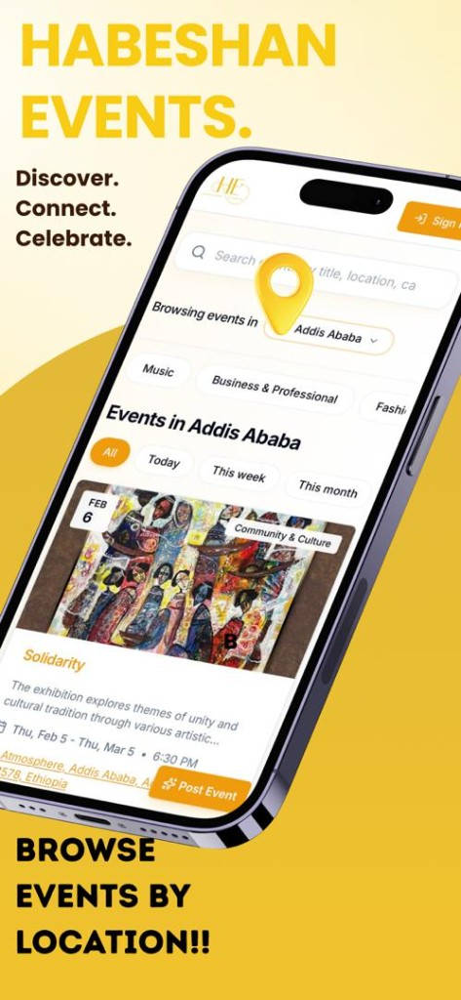
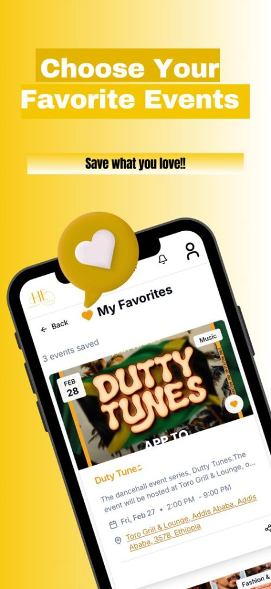
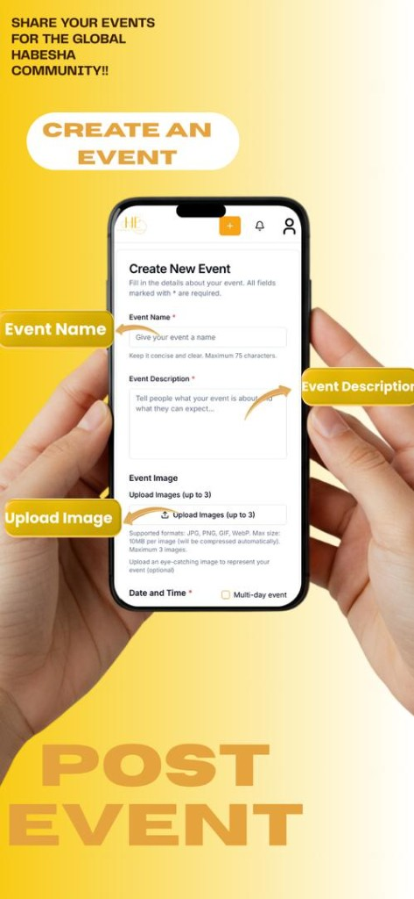
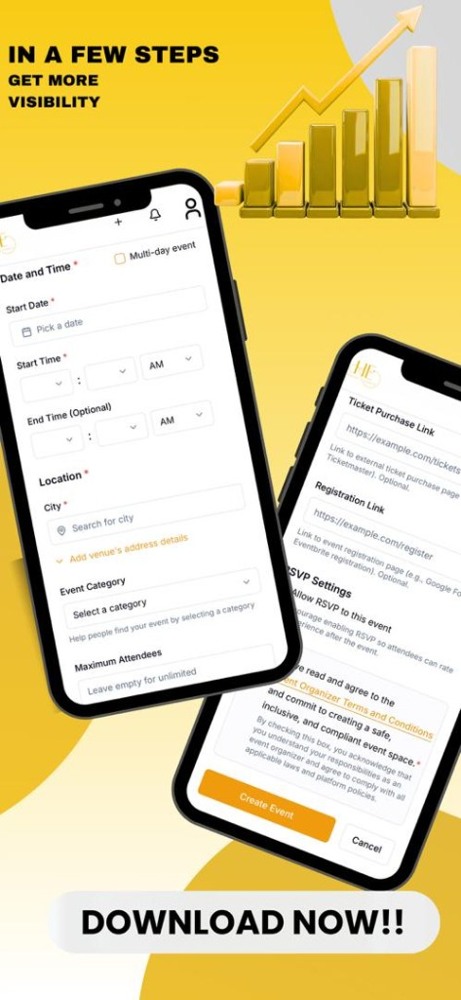

  

<h1 align="center">Habeshan Events</h1>

  <strong>Discover. Connect. Celebrate.</strong> 
  The first event discovery platform built for the Ethiopian and Eritrean community worldwide.

  
  
  

---

## What is Habeshan Events?

**Habeshan Events** is a global platform that helps the Habeshan (Ethiopian & Eritrean) community find cultural, music, networking, and social events near them. Whether you are in Addis Ababa, London, Toronto, Dubai, Washington DC, or anywhere else in the world, Habeshan Events makes it easy to discover what's happening around you.

Unlike generic event platforms, Habeshan Events is built specifically for our community — understanding our cultural celebrations, diaspora dynamics, and the unique ways we come together.

  
  &nbsp;&nbsp;
  
  &nbsp;&nbsp;
  
  &nbsp;&nbsp;
  

## Features

### Discover Events
- **Location-based discovery** — find events happening near you, anywhere in the world
- **Smart search** — search by event name, location, category, or keyword
- **Category filters** — Music, Business & Professional, Community & Culture, Food & Drink, Fashion, Sports, Religious, and more
- **Date filters** — browse events happening today, this weekend, this week, this month, or view all upcoming events
- **Distance-based filtering** — find events within your preferred radius

### RSVP & Engage
- **RSVP system** — let organizers know you're going, maybe attending, or can't make it
- **Favorites** — save events you're interested in and access them anytime
- **Organizer ratings** — rate organizers after attending their events to help build community trust
- **Push notifications** — get notified about event updates, new RSVPs, and messages

### Connect with Your Community
- **In-app messaging** — communicate directly with event organizers and other attendees
- **User profiles** — customize your profile and build your community presence
- **Event subscriptions** — follow events for real-time updates

### Create & Manage Events
- **Easy event creation** — post your event in minutes with images, descriptions, dates, and venue details
- **Event management** — edit or update your event anytime
- **RSVP tracking** — see who's attending in real time
- **Attendee messaging** — communicate with your attendees directly
- **Organizer dashboard** — track your events, attendees, and ratings
- **Completely free** — no fees, no subscriptions, no hidden costs

### Types of Events You'll Find
- Traditional celebrations (Timket, Meskel, Ethiopian New Year, and more)
- Concerts, DJ nights, and live music
- Business networking and professional meetups
- Food festivals and cultural dining
- Workshops, classes, and educational events
- Community gatherings and social events
- Religious and spiritual events
- Fashion shows and art exhibitions

## Download

### Android

Download the latest APK from the **[Releases](https://github.com/AbelaTs/Habeshan-Events-Android-App-Public-Releases/releases)** page.

1. Download `habeshan-events-vX.X.X.apk` from the latest release
2. Open the file on your Android device
3. Allow installation from unknown sources if prompted
4. Tap **Install**

**Minimum requirement:** Android 5.0 (Lollipop) or higher

### iOS

Available on the App Store:

### Web

Visit **[habeshanevents.com](https://habeshanevents.com)** from any browser.

## Why Habeshan Events?

The Habeshan community has never had a dedicated platform like this. Events used to be scattered across Facebook groups, WhatsApp chains, Instagram posts, and word of mouth. Habeshan Events changes that by providing:

- **One place for everything** — a centralized hub for all community events worldwide
- **Targeted reach** — organizers connect directly with the community that cares
- **Global coverage** — works in every city, from Addis Ababa to Melbourne
- **Trust & safety** — organizer ratings, content moderation, and user blocking
- **Always free** — 100% free for both organizers and attendees

## Contact & Support

- **Email:** habeshanevents@gmail.com
- **Website:** [habeshanevents.com](https://habeshanevents.com)
- **iOS App:** [App Store](https://apps.apple.com/us/app/habeshan-events/id6759814994)

---

  <strong>Habeshan Events</strong> — where our community comes together.

